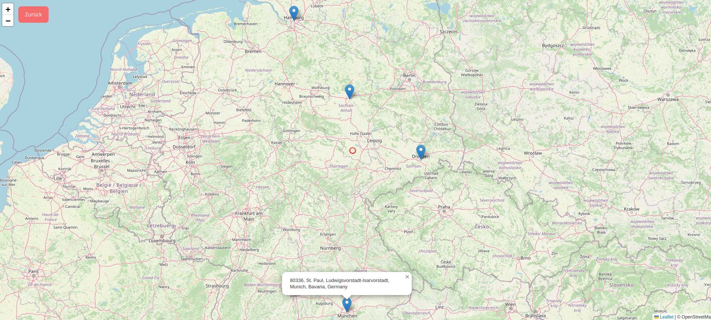

# 🌍 Postalcode Center Finder

**Find the center of multiple locations!**  
This project allows users to input postal codes or city names and calculates the geographic center of those locations. It's a great tool for planning meetups, especially when people have moved to different places but want to find a convenient meeting point. Perfect for reunions, meetups, or any situation where you need to find a midpoint for a group of people. This was created for a school reunion years after.

---

## 🖼️ Screenshots

### Example 1: Enter Postal Codes
  
*Screenshot showing postal code input and calculation of the center.*

### Example 2: Resulting Center Location
  
*Map showing the center location of the entered postal codes or cities.*

---

## 🛠️ Technologies Used

- **HTML/CSS/JavaScript**: For building the interactive web interface.
- **OSM API**: To display the map and calculate geographical distances.

---

## 📥 Input Format

You can input **postal codes** or **city names** into the text field. The website will then:
1. Geocode the input into geographic coordinates (latitude and longitude).
2. Calculate the geographic center of all the locations provided.

---

### Viewing the Website Locally

1. Navigate to the directory
2. Start a local HTTP server using the following command:
   ```bash
   python -m http.server
3. Visit http://127.0.0.1:8000 locally

---

## 🚀 How to Use

1. Go to the website as described
2. Enter postal codes or city names into the input field.
3. Click the button.
4. The map will update to show the central point of all entered locations.